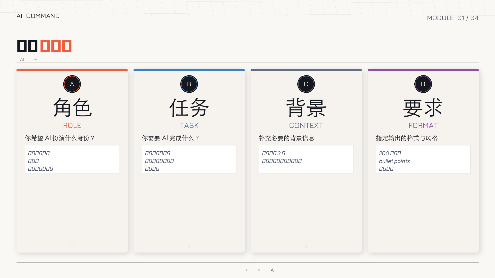

# 🌱 0 基础 AI 实用技能普及课程

> 从零开始，10 分钟掌握 AI 提问方法，让办公与生活效率提升 50%+

---

## 课程介绍

**目标人群**：完全没有 AI 使用经验的普通职场人、学生、生活爱好者（0 基础小白）

**核心目标**：消除 AI 恐惧感，掌握「提问即生产」的能力

**交付物**：一套包含公式卡、指令集、视频脚本和实操手册的综合培训资源包

---

## 📂 课程模块

| 模块 | 内容 | 快速访问 |
|------|------|---------|
| 🎯 万能指令公式卡 | ABCD 四步框架视觉图 | [查看图片](./images/prompt_formula_card.png) |
| 📋 50 场景指令库 | 行政/财务/运营/生活/学习 5 大场景 | [详细内容](./50场景指令库/) |
| 🎬 视频分镜脚本 | 30 秒对比实验视频完整脚本 | [详细内容](./视频分镜/) |
| 🔧 飞书 AI 咒语大全 | 多维表格 AI 使用指南 | [详细内容](./飞书AI咒语/) |
| 📖 PDF 实操手册 | 以上内容整合版，可打印 | [点击下载](../AI实操手册.pdf) |

---

## 🎯 核心方法论：ABCD 公式

```
A — 角色：你希望 AI 扮演谁？
B — 任务：需要 AI 完成什么？
C — 背景：有什么必要信息要告诉它？
D — 要求：输出格式和风格有什么限制？
```

**公式卡预览：**



---

## 🚀 使用指南

### Step 1：记住 ABCD 公式

把 AI 当人看——下命令要具体、下完整。

### Step 2：找一个场景用起来

推荐从 [行政场景指令库](./50场景指令库/) 开始，找到你工作中最常用到的场景，直接复制使用。

### Step 3：用对比实验验证效果

用 [视频分镜脚本](./视频分镜/) 里的方法，对比「模糊提问」和「公式化提问」的差异，亲自感受效果。

---

## 📊 课程路线图

| 周次 | 主题 | 内容 |
|------|------|------|
| 第 1 周 | 内容策划 | 确定 50 个高频小白痛点场景 |
| 第 2 周 | 物料生产 | 拍摄 5 个核心视频，设计通用指令卡片 |
| 第 3 周 | 平台适配 | 内容适配到飞书、Gemini 等不同端 |
| 第 4 周 | 内测迭代 | 找完全不懂 AI 的用户试看并迭代 |

---

## ⭐ 验收标准

- ✅ 学员看完资料后，能独立在 **1 分钟内** 生成一份合格的邮件草稿
- ✅ 全篇文档不出现「神经网络」「参数量」「Token」等术语
- ✅ 提供的指令模板更换关键词后仍能保持高质量输出

---

## 📝 内容贡献者

本课程由 AI COMMAND 团队开发，持续更新中。

如有问题或建议，欢迎提交 Issue 或 Pull Request。

---

*本模块整合自「AI 实用技能普及课程」项目*
